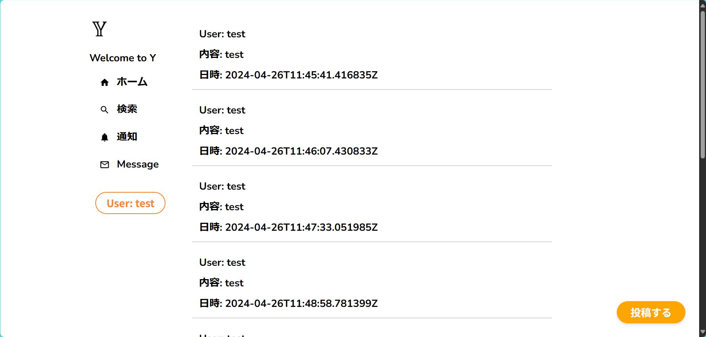

# Next.js を使って X (Twitter)を作ろう！

Next.js というフレームワークを使って、X (Twitter) のような簡単な SNS サービスを作ってみましょう！！
イベント参加者全員でやりとりできる SNS の完成を目指します！！

## 作業する内容

編集してもらうファイル

- app/work/post.tsx
  - このファイルには、「投稿」するための処理とデザインが書かれています。
- app/work/tweetview.tsx
  - このファイルには、投稿された内容を一覧表示するための処理とデザインが書かれています。

## 作業の流れ

1. ユーザー登録とログインをしてみましょう
2. 投稿された内容を一覧で見れるようにしましょう
3. 投稿できるようにしましょう
